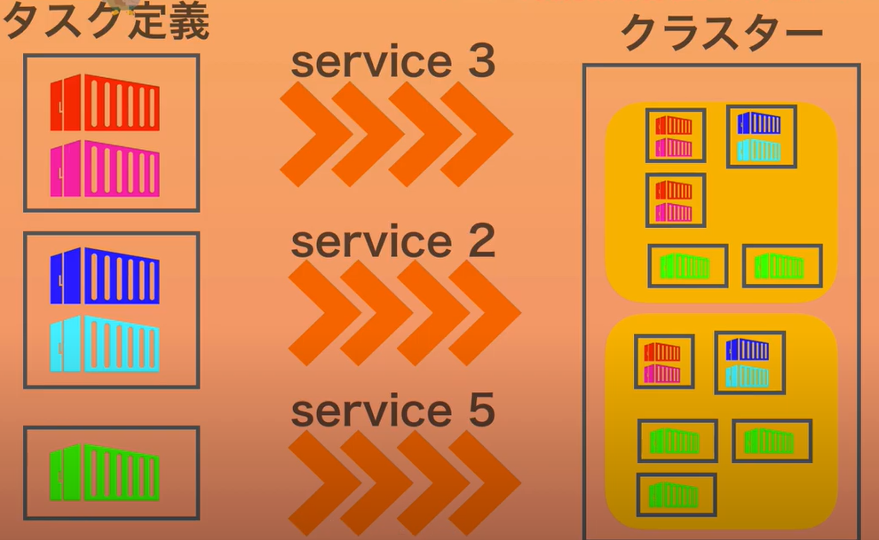
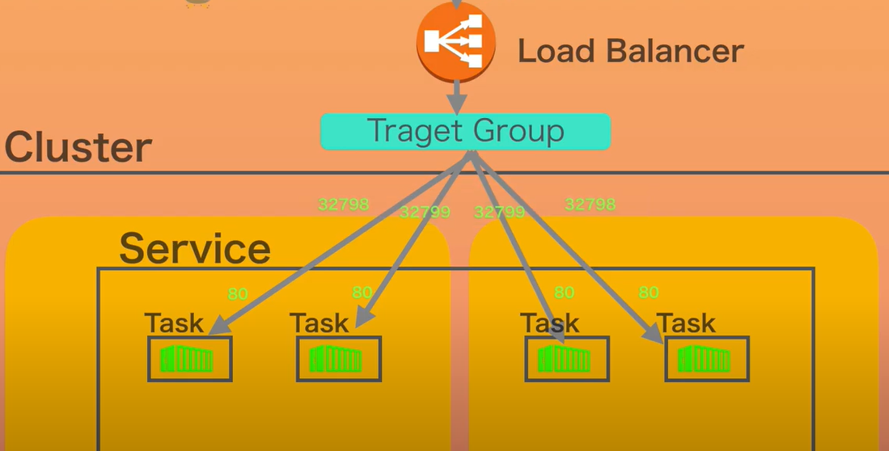
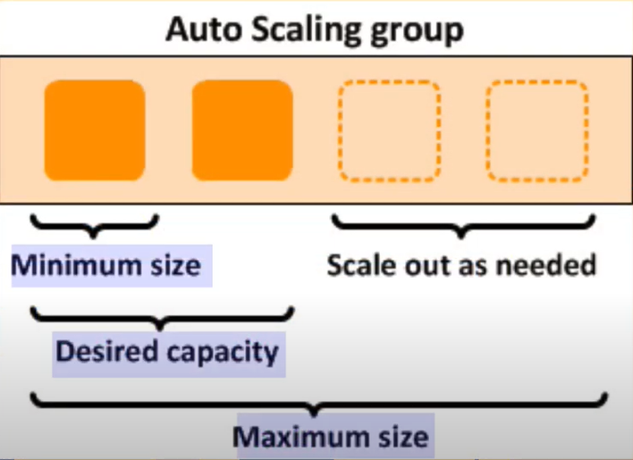
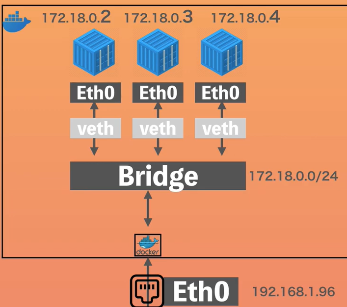
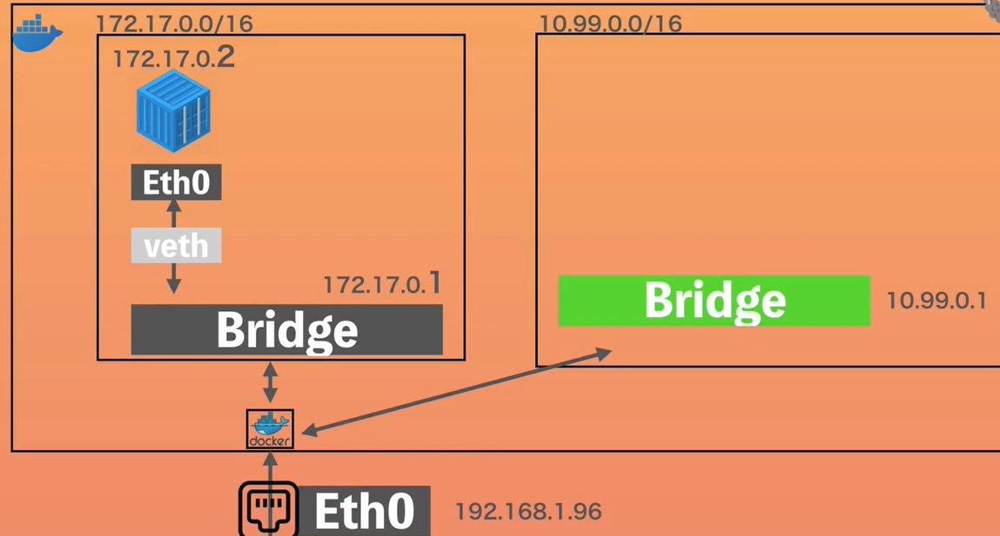
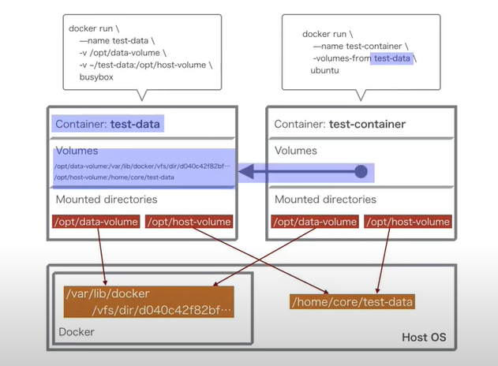
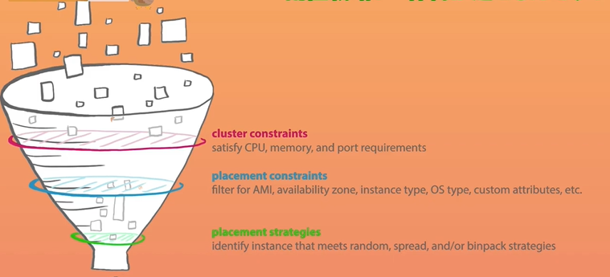

# ECS
```
 - Cluster
   - Service: role
   - Task: Container
   - ECS Instance: fagate or EC2
   - Metric: CPU/Memory etc...
   - Task Schedule
   - Tags
   - Capacity Providor

 - Task Definition
   - set Container config
   - Revision: Version
```


```
<Cluster/Service>
 - Task
 - ELB
 - Auto Scalling
 - etc...

<Task Definition>
 - Image (DockerHub/ECR)
 - Network config
 - CPU/Memory
 - IAM Role
 - Log Driver
 - etc...
```

タスク定義１：サービス１（タスク数定義）


```
クライアントがサービスにアクセスするにはロードバランサ―経由
サービスに関連づいたタスク全てに対してバランシング

bridgeネットワークモード
Dockerfile EXPOSE 80
docker run ... -p 80:80
上記でホスト側のポートとコンテナポートを紐づけ
ECS設定で、ホストポートを0にすると、エフェメラルポート（一時的なポート番号）が割り当てられる
EC2側SG設定で、ロードバランサ―のSGを許可（ポート範囲0-65535）
```



バージョンの更新
```
<開発> 
V1 -> V2

<ECR>
V1 -> V2

<ECSタスク定義>
コンテナURI -> V2指定
タスク定義のリビジョンナンバーV1 -> V2

<ECS実行環境>
サービスの更新
```


オートスケーリンググループ
```
ECSのスケーリング（タスク数）
閾値（サービスの合算）: CPU使用率、メモリ使用率
タスク数: 最小値、最大値、希望する数を設定

ex) ＜ECS>
    最小4、最大10
    ECS設定　512MB/task -> 4台/EC2まで可能

    <EC2>
    最小2、最大3
    t3.micro -> 2GB(2048MB) memory

    <スケーリングポリシー>
　　EC2(2task) + EC2(2task) -> EC2(3task) + EC2(3task)になったらEC2を1台増やすことに！
    カスタムメトリクス、MemoryReservationでサービス全体が75%を超えたら1台EC2を増やす

```



# EC2/Fagate
```
<両方>
・Docker deamon/Container Agentがインストール済

<EC2>
・EC2とコンテナ両方のスケーリングを意識する必要がある。
 -Auto Scallingとサービスの管理　※Capacity Providerで解決できるときも？
 ・サーバー停止のタイミングを考慮

<Fagate>
・一時ローカルボリューム約20GB制限（ver1.4)
・EC2に比べ20%ほどコスト高い。　※Fagate Spotで工夫。

<???>
・Fagateはssh接続できない？
```

# Network


```
$ docker network create --attachable -d bridge --subnet=10.99.0.0/16 ***
$ docker run --name <> -d -p 8082:80 --net *** dockerdemo:latest
```



### Storage Mount
```
volumes   : docker管理
DockerfileのVOLUMEでコンテナ側のパスを指定すると、ホストの/var/lib/docker/volumes/hash.../_data/にマウントされる。

bind mount: host管理
$ docker container run --name ... -d -p 80:80 -v $(pwd):<container path> <image name>:latest
```

### IAM Role
```
<ecsInstanceRole>
・Conatiner AgentがAWSサービスAPIをしようするため
  /ECS/ECR/CloudWatch/...
```

# Task Definition
```
Each Container
/image/cpu/memory/port/volume/network/iam

<Task Role>
・サービスとの連携。RDS接続など

<Network Mode>
/default/bridge/host/awsvpc/none
※awsvpc: EC2にアタッチされているENI以外に、タスク毎にENIをアタッチできる。
　タスク毎にPort、SGを設定できる。同一EC2内の異なるコンテナがそれぞれPort:80を使用可能。
　VPCフローログで観測も可能。ALBなどでターゲットとして登録可能。
　インスタンスタイプでENI数に上限。t2.small:3つまで、t2.micro:2つまで。

<Task Excecution Role>
/ecsTaskExecutionRole/その他
・ECRからのpullなど
```

コンテナ定義
```
<Container Definition>
docker runコマンドのそれぞれのオプションに対応

<スタンダード>
イメージ: --image
メモリ制限: --memory , --memory-reservation
　　　　　　ハードリミット: 閾値を超えるとコンテナプロセス終了  ソフトリミット: コンテナでメモリ確保。超えて使用してもOK。
ポートマッピング: -p , --publish

<ヘルスチェック>
ヘルスチェック: --health-cmd , --health-interval , --health-retries（デフォルトは3回）など

<環境>
CPUユニット数: --cpus
エントリポイント, コマンド, 作業ディレクトリ: Dockerfileで定義した設定を上書きできる。
環境変数: -e , --env

<コンテナタイムアウト>
コンテナタイムアウト: 依存関係を定義。起動順序、停止順序をコントロール。

<ネットワーク環境>
リンク: --link  但し非推奨
ホスト名: --hostname
DNSサーバ: --dns

<ストレージとログ>
ボリュームソース: -volumes-from <まるっとボリュームとして仕様するコンテナ名>
ログ設定: awslogs指定でcloudWatchLogsにログが出力される。 Auto-configure CloudWatch Logsをチェックすると、ロググループ、リージョン、ストリームが自動で追加される。

<セキュリティ>
特権付与: root権限与えるか否か。
ユーザー: コンテナ内で私用するユーザーを制限。

<リソースの制限>
ulimit: --ulimit ファイルディスクリプタの数の制限など。linuxの機能。
```

ボリュームソース



制約


```
3つのフィルターを通す

<cluster constraints>
基本的な確認

<placement constraints>
配置戦略で、特定のEC2を指定することもできる
ex) attribute:ecs.instance-type == t2.small
    attribute:ecs.availability-zone in [us-east-1a, us-east1b]
    attribute:ecs.instance-type =~ g2.* attribunte:ecs.availability-zone != us-east-1d
参考: https://docs.aws.amazon.com/ja_jp/AmazonECS/latest/developerguide/cluster-query-language.html

<placement strategles>
```