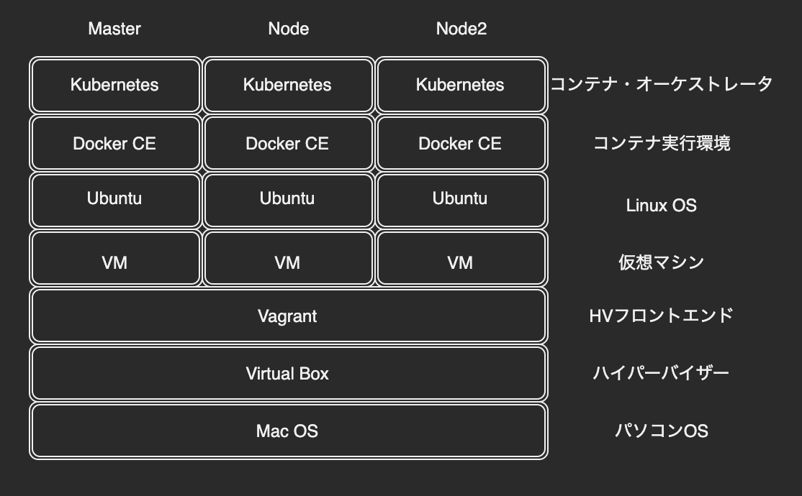

# 環境構築
参考のGithubからのクローン。マルチノード構成。
環境構築ファイルのコード理解は、今回は努めないこととしました。

```
vagrant-kubernetes
├── LICENSE
├── README.md
├── Vagrantfile
├── ansible.cfg
├── hosts
└── playbook
    ├── install_master.yml
    ├── install_node.yml
    ├── kubernetes
    │   ├── defaults
    │   │   └── main.yml
    │   ├── tasks
    │   │   └── main.yml
    │   └── templates
    │       └── kubernetes.repo
    ├── master
    │   ├── tasks
    │   │   └── main.yml
    │   └── templates
    │       └── kube-flannel.yml
    └── node
        └── tasks
            └── main.yml
```


```
$ cd vagrant-kubernetes
$ vagrant up
```

# Training Life-cycle
```
開始
$ vagrant status
$ vagrant up
$ vagrant ssh master

停止
$ logout
$ vagrant halt
```

# 状態確認
```
$ kubectl get node
NAME     STATUS   ROLES    AGE   VERSION
master   Ready    master   42m   v1.14.10
node1    Ready    <none>   36m   v1.14.10
node2    Ready    <none>   31m   v1.14.10


$ kubectl cluster-info
------------------------------
Kubernetes master is running at https://172.16.20.11:6443
KubeDNS is running at https://172.16.20.11:6443/api/v1/namespaces/kube-system/services/kube-dns:dns/proxy
Metrics-server is running at https://172.16.20.11:6443/api/v1/namespaces/kube-system/services/https:metrics-server:/proxy

To further debug and diagnose cluster problems, use 'kubectl cluster-info dump'.


$ kubectl get componentstatus
------------------------------
NAME                 STATUS    MESSAGE             ERROR
controller-manager   Healthy   ok
scheduler            Healthy   ok
etcd-0               Healthy   {"health":"true"}

```

# 参考書籍
15stepで習得　Dockerから入るKubernetes
