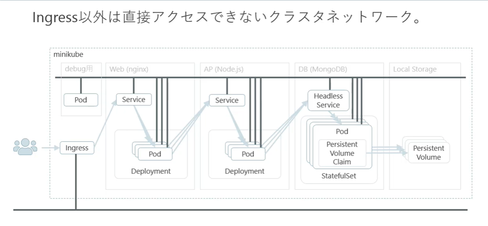
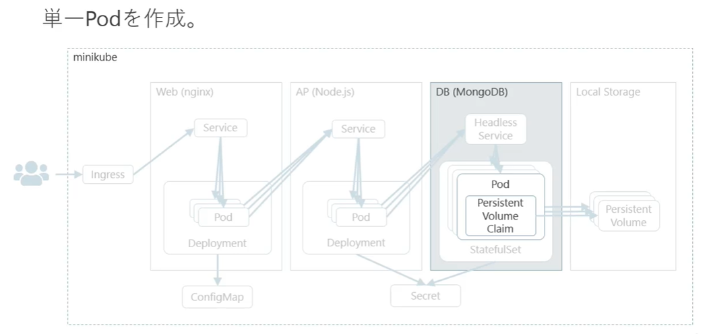
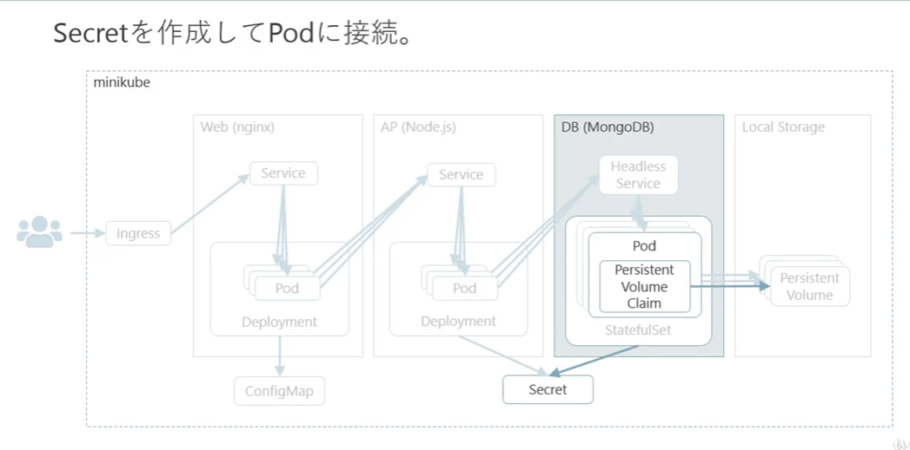
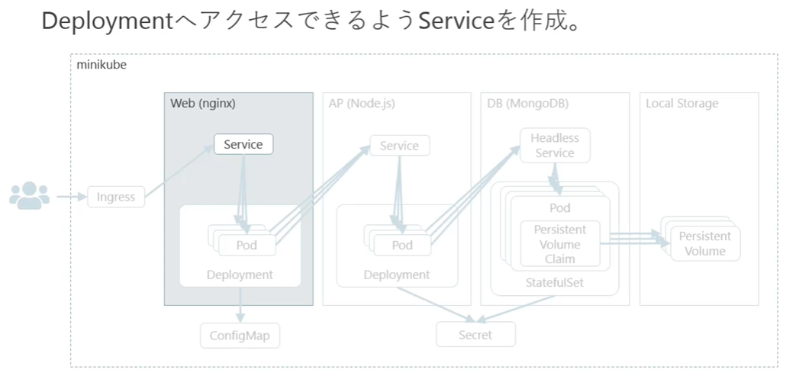

# 構成




# デバッグ用イメージ作成
### file: mongodb-org-4.0.repo
```s
https://docs.mongodb.com/manual/tutorial/install-mongodb-on-red-hat/

$ vi mongodb-org-4.0.repo
[mongodb-org-4.0]
name=MongoDB Repository
baseurl=https://repo.mongodb.org/yum/redhat/$releasever/mongodb-org/4.0/x86_64/
gpgcheck=1
enabled=1
gpgkey=https://www.mongodb.org/static/pgp/server-4.0.asc
```

### Dockerfile
```s
FROM centos:7

COPY . /tmp/debug

RUN \
mv /tmp/debug/mongodb-org-4.0.repo /etc/yum.repos.d; \
yum install -y mongodb-org-shell-4.0.5 mongodb-org-tools-4.0.5; \
yum install -y iproute net-tools; \
curl -o /usr/local/bin/jq -L https://github.com/stedolan/jq/releases/download/jq-1.6/jq-linux64; \
chmod +x /usr/loca/bin/jq; \
yum clean all;
```
```s
$ docker build -t debug .
$ docker image ls
$ docker run -it debug sh
> $ mongo
> $ ip
> $ ifconfig
> $ jq
> $ exit
$ docker container prune
```

### debug-pod.yml
```yml
apiVersion: v1
kind: Pod
metadata:
  name: debug
  namespace: default
  labels:
    app: weblog
    env: study
spec:
  containers:
  - name: debug
    imae: debug
    iamgePullPolicy: Never
    command:
    - "sh"
    - "-c"
    args:
    - |
      while true
      do
        sleep 5
      done
```
```s
$ kubectl apply -f debug-pod.yml
$ kubectl get po
$ kubectl exec -it debug sh
> ip
> mongo
> ifconfig
> jq
> exit
$ kubeclt get po
  まだRunningしてるか確認
```


# DB

## DB_image ----------
### .dockerignore
```s
**/.git
**/.DS_Store
**/node_modules
```

### docker-entrypoint.sh
```s
#! /bin/sh
INIT_FLAG_FILE=/data/db/init-completed
INIT_LOG_FILE=/data/db/init-mongod.log

start_mongod_as_deamon() {
echo
echo "> start mongod ..."
echo
mongod \
  --fork \
  --logpath ${INIT_LOG_FILE} \
  --quiet \
  --bind_ip 127.0.0.1 \
  --smallfiles;
}

create_user() {
echo
echo ">create user ..."
echo
if [ ! "$MONGO_INITDB_ROOT_USERNAME" ] || [ ! "$MONGO_INITDB_ROOT_PASSWORD" ]; then
  return
fi
mongo "${MONGO_INITDB_DATABASE}" <<-EOS
  db.createUser({
    user: "",
    pwd: "",
    roles: [{ role: "root", db: "${MONGO_INITDB_DATABASE:-admin}"}]
  })
EOS
}

create_initialize_flag() {
echo
echo "> create initialize flag file ..."
echo
cat <<-EOF > "${INIT_FLAG_FILE}"
[$(data +%Y-%m-%dT%H:%M:%S.%3N)] Initialize scripts if finished.
EOF
}

stop_mongod() {
echo
echo ">stop mongod ..."
echo
mongod --shutdown
}

if [ ! -e ${INIT_LOG_FILE} ]; then
  echo
  echo "--- Initialize MongoDB ---"
  echo
  start_mongod_as_deamon
  create_user
  create_initialize_flag
  stop_mongod
fi

# 後続のコマンドを引数に実行
exec "$@"
```

### Dockerfile
```s
FROM alpine:3.9

COPY docker-entrypoint.sh /usr/local/bin

RUN \
adduser -g mongodb -DB -u 1000 mongodbh; \
apk --no-cache add mongodb-4.0.5-r0; \
chmod +x /usr/local/bin/docker-entrypoint.sh; \
mkdir -p /data/db; \
chown -R mongodb:mongodb /data/db;

VOLUME /data/db

EXPOSE 27017

ENTRYPOINT [ "docker-entorypoint.sh" ]
CMD [ "mongod" ]
```

```s
$ docker built -t weblog-db:v1.0.0 .
$ docker run -d weblog-db:v1.0.0
$ docker container ls
$ docker exec  -it ... sh
> $ mongo
> $ show dbs
> $ exit
$ docker stop ...
$ docker system prune
```

## DB_storage----------

### weblog-db-storage.yml
```yml
apiVersion: v1
kind: PersistentVolume
metadata:
  name: storage-volume
  namespace: default
  labels:
    app: weblog
    type: storage
spec:
  storageClassName: slow
  capacity:
    storage: 1Gi
  accessModes:
  - ReadWriteMany
  hostPath:
    path: "/data/storage"
    type: Directory

---
apiVersion: v1
kind: PersistentVolumeClaim
metadata:
  name: storage-claim
  namespace: default
  labels:
    app: weblog
    type: storage
spec:
  storageClassName: slow
  accessModes:
  - ReadWriteMany
  resources:
    requests:
      storage: 1Gi
```
```s
$ ls /data
  storage
$ kubectl apply -f weblog-db-storage.yml
$ kubectl get pvc,pv
```

## DB_pod

### weblog-db-storage.ymlのつづき
```yml
apiVersion: v1
kind: Pod
metadata:
  name: mongodb
  namespece: default
  labels:
    app: weblog
    type: database
spec:
  containers:
  - name: mongodb
    image: weblog-db:v1.0.0
    imagePullPolicy: Never
    command:
    - "mongod"
    - "--bind-ip-all"
    volumeMounts:
    - mountPath: "/data/db"
      name: storage
  volumes:
  - name: storage
    persistentVolumeClaim:
      claimeName: storage-claim    # PersistentVolumeClaim/metadata.nameと一致させる
```
```s
$ ls /data/storage/
  空であることを確認、あれば一度空に
$ kubectl apply -f weblog-db-storage.yml
$ kubectl get po,pvc,pv
$ ls /data/storage/
  マウントされてることを確認
$ kubectl exec -it mongodb sh
> $ mongo
> $ show dbs
> $ exit
```

## DB_pod, secret

```s
$ openssl rand -base64 1024 | tr -d '\r\n' | cut -c 1-1024 > keyfile
  ランダム文字列生成（1024文字　base64）, 改行文字列削除 , 必要サイズにカット
$ ls
  keyfile weblog-db-pod.yml
$ kubectl create secret generic mongo-secret \
> --from-literal=root_username=admin \
> --from-literal=root_password=Passw0rd \
> --from-file=./keyfile
$ kubectl get secret/mongo-secret -o yaml
apiVersion: ...
...
data:
  keyfile: fjdsapoiw;aif;awifjksflas;fjwj;oiew...
  root_password: oiewjewjf..
  root_username: fjioewaef..
kind: Secret
...
```

- 取り出したyamlデータをコピー
- weblog-db-pod.ymlのpvcとpodの間にペースト
- 編集

### weblog-db-pod.yml
```yml
pvc...
---
apiVersion: v1
kind: Secret
metadata:
  name: mongo-secret
  namespace: default
  labels:
    app: weblog
    type: database
type: Ppaque
data:
  root_username: fjioewaef..
  root_password: oiewjewjf..
  keyfile: fjdsapoiw;aif;awifjksflas;fjwj;oiew...
---
pod...
```
```s
$ kubectl delete secret/mongo-secret
```
- podにsecretを接続
```yml
pod/spec.contaienrs.commandの下
spec:
  containers:
  - name: mongodb
    ...
    # command:
    # - "mongod"
    # - "--bind_ip_all"  DockerfileのENTRYPOINTが上書きされてしまうので↓に変更
    args:
    - "mongod"
    - "--auth"
    - "--bind_ip_all"
    env:
    - name: "MONGO_INITDB_ROOT_USERNAME"
      valueFrom:
        secretKeyRef:
          name: mongo-secret
          key: root_username
    - name: "MONGO_INITDB_ROOT_PASSWORD"
      valueFrom:
        secretKeyRef:
          name: mongo-secret
          key: root_password
    - name: "MONGO_INITDB_ROOT_DATABASE"
      value: "admin"
    volumeMounts:
    - mountPath: ...
      ...
    - mountPath: /home/mongodb
      name: secret
  volumes:
  - name: ...
    ...
  - name: secret
    secret:
      secretName: mongo-secret
      items:
      - key: keyfile
        path: keyfile
        mode: 0700
```
```s
$ ls /data/storage
  空に
$ kubectl apply -f weblog-db-pod.yml
$ kubectl get po
$ kubectl exec -it mongodb sh
> $ mongo
> $ show dbs
  動かない
> $ use admin
> $ db.auth("admin", "Passw0rd")
> $ show dbs
    OK!
> $ exit
```

## DB_StatefulSet
- レプリケーション（DB冗長化）: プライマリ（読み書き）　セカンダリ（読み取り専用）
### weblog-db-pod+secret.yml
```yml
apiVersion: v1
kind: PersistentVolume
metadata:
  name: storage-volume-0
  namespace: default
  labels:
    app: weblog
    type: storage
spec:
  storageClassName: slow
  capacity:
    storage: 1Gi
  accessModes:
  - ReadWriteMany
  hostPath:
    # path: "/data/storage"
    path: "/data/pv0000"
    type: Directory

---
apiVersion: v1
kind: PersistentVolume
metadata:
  name: storage-volume-1
  namespace: default
  labels:
    app: weblog
    type: storage
spec:
  storageClassName: slow
  capacity:
    storage: 1Gi
  accessModes:
  - ReadWriteMany
  hostPath:
    path: "/data/pv0001"
    type: Directory

---
apiVersion: v1
kind: PersistentVolume
metadata:
  name: storage-volume-2
  namespace: default
  labels:
    app: weblog
    type: storage
spec:
  storageClassName: slow
  capacity:
    storage: 1Gi
  accessModes:
  - ReadWriteMany
  hostPath:
    path: "/data/pv0002"
    type: Directory

# Template化したので削除
# ---
# apiVersion: v1
# kind: PersistentVolumeClaim
# metadata:
#   name: storage-claim
#   namespace: default
#   labels:
#     app: weblog
#     type: storage
# spec:
#   storageClassName: slow  # この塊をコピー
#   accessModes:
#   - ReadWriteMany
#   resources:
#     requests:
#       storage: 1Gi        # ここまで

---
apiVersion: v1
kind: Secret
metadata:
  name: mongo-secret
  namespace: default
  labels:
    app: weblog
    type: database
type: Ppaque
data:
  root_username: fjioewaef..
  root_password: oiewjewjf..
  keyfile: fjdsapoiw;aif;awifjksflas;fjwj;oiew...

---
# apiVersion: v1
apiVersion: apps/v1
# kind: Pod
kind: StatefulSet
metadata:
  name: mongo
  namespace: default
  labels:
    app: weblog
    type: database
spec:
  selector:
    matchLabels:
      app: weblog
      type: database
  seviceName: db-svc # 仮
  replicas: 3
  template:
    # 再利用→
    metadata:
      name: mongodb
      namespece: default
      labels:
        app: weblog
        type: database
    spec:
      # 追記
      terminationGracePeriodSeconds: 10
      containers:
      - name: mongodb
        image: weblog-db:v1.0.0
        imagePullPolicy: Never
        args:
        - "mongod"
        - "--auth"
        # 追記
        - "--clusterAuthMode=keyFile"
        - "--keyFile=/home/mongodb/keyfile"
        - "--replSet=rs0"
        - "--bind_ip_all"
        env:
        - name: "MONGO_INITDB_ROOT_USERNAME"
          valueFrom:
            secretKeyRef:
              name: mongo-secret
              key: root_username
        - name: "MONGO_INITDB_ROOT_PASSWORD"
          valueFrom:
            secretKeyRef:
              name: mongo-secret
              key: root_password
        - name: "MONGO_INITDB_ROOT_DATABASE"
          value: "admin"
        volumeMounts:
        - mountPath: "/data/db"
          name: storage
        - mountPath: /home/mongodb
          name: secret
      volumes:
      # - name: storage
      #   persistentVolumeClaim:
      #     claimeName: storage-claim    # PersistentVolumeClaim/metadata.nameと一致させる
      - name: secret
        secret:
          secretName: mongo-secret
          items:
          - key: keyfile
            path: keyfile
            mode: 0700
  # 追記
  volumeClaimTemplates:
  - metadata:
      name: storage
    spec: # pvcからコピー↓
      storageClassName: slow  
      accessModes:
      - ReadWriteMany
      resources:
        requests:
          storage: 1Gi
```
```S
$ mkdir -p /data/pv0000; mkdir -p /data/pv0001; mkdir -p /data/pv0002
$ kubectl get po
  debug だけ Running
$ kubectl apply -f weblog-db-pod+secret.yml
  persistentvolume/storage-volume-0 created
  persistentvolume/storage-volume-1 created
  persistentvolume/sotrage-volume-2 created
  secret/mongo-secret created
  statefulset.apps/mongo created
$ kubectl get pod -w
$ kubectl get po
$ kubectl exec -it mongo-0 sh
> $ mongo
> $ use admin
> $ db.auth("admin", "Passw0rd")
> $ exit
$ kubectl delete -f weblog-db-pod+secret.yml
  deleteできない
$ kubectl get pvc,pv
  明示的にファイル内に定義されていないのでうまく削除できない
$ kubectl delete persistentvolumeclaim/storage-mongo-0 persistentvolumeclaim/storage-mongo-1 persistentvolumeclaim/storage-mongo-2 persistentvolume/storage-volume-0 persistentvolume/storage-volume-1 persistentvolume/storage-volume-2
$ kubectl get pvc,pv,po
```


## DB_HeadlessService
### weblog-db-pod+secret.ymlの編集
```yml
apiVersion: v1
kind: PersistentVolume
metadata:
  name: storage-volume-0
  namespace: default
  labels:
    app: weblog
    type: storage
spec:
  storageClassName: slow
  capacity:
    storage: 1Gi
  accessModes:
  - ReadWriteMany
  hostPath:
    path: "/data/pv0000"
    type: Directory

---
apiVersion: v1
kind: PersistentVolume
metadata:
  name: storage-volume-1
  namespace: default
  labels:
    app: weblog
    type: storage
spec:
  storageClassName: slow
  capacity:
    storage: 1Gi
  accessModes:
  - ReadWriteMany
  hostPath:
    path: "/data/pv0001"
    type: Directory

---
apiVersion: v1
kind: PersistentVolume
metadata:
  name: storage-volume-2
  namespace: default
  labels:
    app: weblog
    type: storage
spec:
  storageClassName: slow
  capacity:
    storage: 1Gi
  accessModes:
  - ReadWriteMany
  hostPath:
    path: "/data/pv0002"
    type: Directory

---
apiVersion: v1
kind: Secret
metadata:
  name: mongo-secret
  namespace: default
  labels:
    app: weblog
    type: database
type: Ppaque
data:
  root_username: fjioewaef..
  root_password: oiewjewjf..
  keyfile: fjdsapoiw;aif;awifjksflas;fjwj;oiew...

# 追記
---
apiVersion: v1
kind: Service
metadata:
  name: db-svc
  namespace: default
  labels:
    app: weblog
    type: database
spec:
  ports:
  - port: 27017
    targetPort: 27017 # mongodbのdefaultのport
  clusterIP: None
  selector:
    app: weblog
    type: database

---
apiVersion: apps/v1
kind: StatefulSet
metadata:
  name: mongo
  namespace: default
  labels:
    app: weblog
    type: database
spec:
  selector:
    matchLabels:
      app: weblog
      type: database
  seviceName: db-svc # 仮
  replicas: 3
  template:
    metadata:
      name: mongodb
      namespece: default
      labels:
        app: weblog
        type: database
    spec:
      terminationGracePeriodSeconds: 10
      containers:
      - name: mongodb
        image: weblog-db:v1.0.0
        imagePullPolicy: Never
        args:
        - "mongod"
        - "--auth"
        - "--clusterAuthMode=keyFile"
        - "--keyFile=/home/mongodb/keyfile"
        - "--replSet=rs0"
        - "--bind_ip_all"
        env:
        - name: "MONGO_INITDB_ROOT_USERNAME"
          valueFrom:
            secretKeyRef:
              name: mongo-secret
              key: root_username
        - name: "MONGO_INITDB_ROOT_PASSWORD"
          valueFrom:
            secretKeyRef:
              name: mongo-secret
              key: root_password
        - name: "MONGO_INITDB_ROOT_DATABASE"
          value: "admin"
        volumeMounts:
        - mountPath: "/data/db"
          name: storage
        - mountPath: /home/mongodb
          name: secret
      volumes:
      - name: secret
        secret:
          secretName: mongo-secret
          items:
          - key: keyfile
            path: keyfile
            mode: 0700
  volumeClaimTemplates:
  - metadata:
      name: storage
    spec:
      storageClassName: slow  
      accessModes:
      - ReadWriteMany
      resources:
        requests:
          storage: 1Gi
```
```s
$ ls /data/pv0000
  空であることを確認
$ kubectl get po
debug ...
$ kubectl apply -f weblog-db-pod+secret.yml
$ kubectl get po -w
$ kubectl exec -it mongo-0 sh
> $ ping mongo-1.db-svc  # pod名+HeadlessSercive名で名前解決できる
    接続確認...
> $ mongo
  > $ use admin
  > $ db.auth("admin", "Passw0rd")
  > $ rs.initiate({
    ... _id: "rs0"
    ... members: [
    ... { _id: 0, host: "mongo-0.db-svc:27017" },
    ... { _id: 1, host: "mongo-1.db-svc:27017" },
    ... { _id: 2, host: "mongo-2.db-svc:27017" },
    ... ]
    ... })
    { "ok" : 1 }
    rs0:OTHER> rs.status
    ...
    DBの初期化OK!
    rs0:PRIMARY> show dbs
    rs0:PRIMARY> exit
> $ exit
```
- ここからは起動したままに。


## DB_初期化
ファイル用意
```s
$ kubectl get po
  debug ...
  mongo-0
  mongo-1
  mongo-2
$ ls
  adduser.js  drop.js  init.sh  insert.js
$ kubectl cp . debug:/root/init-db/
$ kubectl exec -it debug sh
> $ ls /root/init-db
    adduser.js  drop.js  init.sh  insert.js
> $ mongo mongo-0.db-svc
  rs0:PRIMARY> use admin
  rs0:PRIMARY> db.auth("admin", "Passw0rd")
  rs0:PRIMARY> rs.status()
  ...PRIMARYであることを確認
  rs0:PRIMARY> exit
> $ vi init.sh 確認
> $ sh init.sh
    ...
> $ mongo mongo-0.db-svc
  rs0:PRIMARY> use admin
  rs0:PRIMARY> db.auth("admin", "Passw0rd")
  rs0:PRIMARY> show dbs
               weblogが追加されてることを確認
  rs0:PRIMARY> use weblog
  rs0:PRIMARY> show collections
  rs0:PRIMARY> db.posts.find().pretty()
  rs0:PRIMARY> exit
> $ exit
```


# APserver_Image
ファイルのコピー
### .dockerignore
```s
**/.vscode
**/.git
**/.DS_Store
**/node_modules
*.log
```
### docker-entrypoint.sh
```s
#! /bin/sh

if [ -n "${MONGODB_HOSTS}" ]; then
  node ./lib/dtabase/wait.js
else
  echo "WARN: MONGODB_HOSTS is not defines."
fi

exec "$@"
```

### Dockerfile
```s
FROM node:10-alpine
COPY . /hoe/node/webapp
RUN cd /home/node/webfapp; \
    mv docker-entrypoint.sh /usr/local/bin; \
    chmod +x /usr/local/bin/docker-entrypoint.sh \
    yarn install;
EXPOSE 3000
WORKDIR /home/node/webapp
ENTRYPOINT [ "docker-entrypoint.sh" ]
CMD [ "npm", "start" ]
```
```s
$ docker build -t weblog-app:v1.0.0 .
$ kubectl get po
  debug ...
  mongo-0
  mongo-1
  mongo-2
$ kubectl exec -it mongo-0 sh
$ mongo
> ... PRIMARYを確認　mongo-2だとして...
$ kubectl get po -o wide
  mongo-2のIPを確認
$ vi weblog-db-service.yml
```

### weblog-db-service.yml
```yml
apiVersion: v1
kind: Service
metadata:
  name: mongodb
  namespace: default
  labels:
    env: study
spec: 
  ports:
  - port: 27017
    targetPort: 27017
    nodePort: 32717
  type: NodePort

---
apiVersion: v1
kind: Endpoints
metadata:
  name: mongodb
  namespace: default
  labels:
    env: study
  subsets:
  - addresses:
    - ip: 172.17.9.11   # mongo-2のip
    ports:
    - port: 27017
```

```S
$ kubectl apply -f weblog-db-service.yml
$ docker run \
  -e MONGODB_USERNAME="user" \
  -e MONGODB_PASSWORD="welcome" \
  -e MONGODB_HOST="192...:32717" \   # ifconfigなどでVMのipを
  -e MONGODB_DATABASE="weblog" \
  -d \
  -p 8080:3000 \
  weblog-app:v1.0.0

<ブラウザで確認>
192...:8080

$ docker stop 名前
$ docker container prune
$ kubectl delete -f weblog-db-service.yml
  エラー　特に問題なし
$ kubectl get svc,ep
```


## APserver_pod+secret


### weblog-app-pod.yml
```yml
apiVersion: v1
kind: Secret
metadata:
  name: mongo-secret
  namespace: default
  labels:
    app: weblog
    type: database
type: Ppaque
data:
  root_username: fjioewaef..
  root_password: oiewjewjf..
  weblog_username: ... # user
  weblog_password: ... # password
  keyfile: fjdsapoiw;aif;awifjksflas;fjwj;oiew...

---
apiVersion: v1
kind: Pod
metadata:
  name: nodeapp
  namespace: default
  labels:
    app: weblog
    type: application
spec:
  containers:
  - name: node
    image: weblog-app:v1.0.0
    imagePullPolicy: Never
    ports:
    - containerPort: 3000
    env:
    - name: "MONGODB_USERNAME"
      valueFrom:
        secretKeyRef:
          name: mongo-secret
          key: weblog_username
    - name: "MONGODB_PASSWORD"
      valueFrom:
        secretKeyRef:
          name: mongo-secret
          key: weblog_password
    - name: "MONGODB_HOSTS"
      value: "mongo-0.db-svc:27017,mongo-1.db-svc:27017,mongo-2.db-svc:27017,"
    - name: "MONGODB_DATABASE"
      value: "weblog"
    - name: "MONGODB_REPLICASET"
      value: "rs0"
```

```s
$ echo -n "user" | base64
$ echo -n "passwrod" | base64
```
```s
$ kubectl apply -f weblog-app-pod.yml
$ kubectl get pod
$ kubectl get pod -o wide
  debug ...
  mongo-0
  mongo-1
  mongo-2
  nodeapp           172.17.0.12
$ kubectl exec -it debug sh
> $ curl 172.17.0.12:3000
$ kubectl get po
  secretを消さないように
$ kubectl delete pod/nodeapp
```

## APserver_Deployment

### weblog-app-pod.ymlの編集
```yml
apiVersion: v1
kind: Secret
metadata:
  name: mongo-secret
  namespace: default
  labels:
    app: weblog
    type: database
type: Ppaque
data:
  root_username: fjioewaef..
  root_password: oiewjewjf..
  weblog_username: ... # user
  weblog_password: ... # password
  keyfile: fjdsapoiw;aif;awifjksflas;fjwj;oiew...

---
# apiVersion: v1
# kind: Pod
apiVersion: apps/v1
kind: Deployment
metadata:
  name: nodeapp
  namespace: default
  labels:
    app: weblog
    type: application
spec:
  replicas: 3
  selector:
    matchLabels:
      app: weblog
      type: application
  strategy:
    rollingUpdate:
      maxSurge: 1
      maxUnavailable: 1
    type: RolllingUpdate
  revisionHistoryLimit: 14
  template:
    metadata:
      name: nodeapp
      namespace: default
      labels:
        app: weblog
        type: application
    spec:
      containers:
      - name: node
        image: weblog-app:v1.0.0
        imagePullPolicy: Never
        ports:
        - containerPort: 3000
        env:
        - name: "MONGODB_USERNAME"
          valueFrom:
            secretKeyRef:
              name: mongo-secret
              key: weblog_username
        - name: "MONGODB_PASSWORD"
          valueFrom:
            secretKeyRef:
              name: mongo-secret
              key: weblog_password
        - name: "MONGODB_HOSTS"
          value: "mongo-0.db-svc:27017,mongo-1.db-svc:27017,mongo-2.db-svc:27017,"
        - name: "MONGODB_DATABASE"
          value: "weblog"
        - name: "MONGODB_REPLICASET"
          value: "rs0"
```
```s
$ kubectl apply -f weblog-app-pod.yml
$ kubectl get pod -o wide
  ip check! nodeapp*3
$ kubectl exec -it debug sh
> $ curl 172.17.0.12:3000
> $ curl 172.17.0.13:3000
> $ curl 172.17.0.14:3000
$ kubectl get deploy
$ kubectl delete deploy/nodeapp
```


## APserver_Service

### weblog-app-deployment.yml
```yml
apiVersion: v1
kind: Secret
metadata:
  name: mongo-secret
  namespace: default
  labels:
    app: weblog
    type: database
type: Ppaque
data:
  root_username: fjioewaef..
  root_password: oiewjewjf..
  weblog_username: ... # user
  weblog_password: ... # password
  keyfile: fjdsapoiw;aif;awifjksflas;fjwj;oiew...

# 追記
---
apiVersion: v1
kind: Service
metadata:
  name: app-svc
  namespace: default
  labels:
    app: weblog
    type: application
spec:
  ports:
  - port: 3000
    targetPort: 3000
  selector:
    app: weblog
    type: application

---
apiVersion: apps/v1
kind: Deployment
metadata:
  name: nodeapp
  namespace: default
  labels:
    app: weblog
    type: application
spec:
  replicas: 3
  selector:
    matchLabels:
      app: weblog
      type: application
  strategy:
    rollingUpdate:
      maxSurge: 1
      maxUnavailable: 1
    type: RolllingUpdate
  revisionHistoryLimit: 14
  template:
    metadata:
      name: nodeapp
      namespace: default
      labels:
        app: weblog
        type: application
    spec:
      containers:
      - name: node
        image: weblog-app:v1.0.0
        imagePullPolicy: Never
        ports:
        - containerPort: 3000
        env:
        - name: "MONGODB_USERNAME"
          valueFrom:
            secretKeyRef:
              name: mongo-secret
              key: weblog_username
        - name: "MONGODB_PASSWORD"
          valueFrom:
            secretKeyRef:
              name: mongo-secret
              key: weblog_password
        - name: "MONGODB_HOSTS"
          value: "mongo-0.db-svc:27017,mongo-1.db-svc:27017,mongo-2.db-svc:27017,"
        - name: "MONGODB_DATABASE"
          value: "weblog"
        - name: "MONGODB_REPLICASET"
          value: "rs0"
```
```s
$ kubectl apply -f weblog-app-deployment.yml
$ kubectl get pod
$ kubectl exec -it debug sh
> $ curl http://app-svc:3000/
  3つあるうちのどれかにアクセスしている
> $ exit
$ kubectl get pod
...
...
nodeapp-1...
nodeapp-2...
nodeapp-3...
$ kubectl logs pod/nodeapp-1...
$ kubectl logs pod/nodeapp-2...
　[date][INFO] access - ...
  どのノードにアクセスがあったか分かる
```
APserver完成。削除しない。


# WEBserver_Image


### docker-entrypoint.sh
```s
#! /bin/sh

envsubst '$$APPLICATION_HOST' \
  < /home/nginx/nginx.conf \
  > /etc/nginx/nginx.conf

exec "$@"
```

### Dockerfile
```s
FROM nginx:1.17.2-alpine
COPY . /home/nginx
RUN cd /home/nginx; \
    mv docker-entrypoint.sh /usr/local/bin; \
    chmod +x /usr/local/bin/docker-entrypoint.sh;

ENTRYPOINT ["docker-entrypoint.sh"]
CMD ["nginx", "-g", "daemon off;"]
```

image build
```s
$ doker build -t weblog-web:v1.0.0 .
```

### weblog-app-service.yml
```yml
apiVersion: v1
kind: Service
metadata:
  name: nodeapp
  namespace: default
  labels:
    env: study
spec:
  type: NodePort
  selector:
    app: weblog
    type: application
  ports:
  - port: 3000
    targetPort: 3000
    nodePort: 30000
```

```s
$ kubectl apply -f weblog-app-service.yml
$ docker run \
  -e APPLICATION_HOST=192.168.208.128:30000 \   # ifconfigで確認できる VMのホスト名がapplication_hostに一 ens2桁のもの 30000：nodeのアプリケーションサーバーに対するに対するポート
  -p 8080:80 \ # 80はdockerの内部ポート　8080はVM
  -d \
  weblog-web:v1.0.0
$ docker contaienr ls

<ブラウザ確認>
192.168.208.128:30000

$ docker container ls
$ docker stop ...
$ docker contaienr prune

$ kubectl delete -f weblog-app-service.yml
```


## WEBserver_pod

### weblog-web-pod.yml
```yml
apiVersion: v1
kind: Pod
metadata:
  name: nginx
  namespace: default
  labels:
    app: weblog
    type: frontend
spec:
  containers:
  - name: nginx
    image: weblog-web:v1.0.0
    imagePullPolicy: Never
    ports:
    - containerPort: 80
    env:
    - name: "APPLICATION_HOST"
      value: "app-svc:3000"
```
```s
$ kubectl apply -f weblog-web-pod.yml
$ kubectl get pod -o wide
  nginx ip check!
$ kubectl exec -it debug sh
> $ curl http://nginxのip/
> $ exit
$ kubectl get pod
$ kubectl logs pod/nodeapp-...
  access log check!

$ kubectl delete -f weblog-web-pod.yml
```


## WEBserver_pod_configMap

### weblog-web-pod.yml
```yml
apiVersion: v1
kind: ConfigMap
metadata:
  name: nginx-config
  namespace: default
  labels:
    app: weblog
    type: frontend
data:
  nginx.conf: |
    user  nginx;
    worker_processes  auto;

    error_log  /var/log/nginx/error.log warn;
    pid        /var/run/nginx.pid;


    events {
        worker_connections  1024;
    }


    http {
        include       /etc/nginx/mime.types;
        default_type  application/octet-stream;

        log_format  main  '$remote_addr - $remote_user [$time_local] "$request" '
                          '$status $body_bytes_sent "$http_referer" '
                          '"$http_user_agent" "$http_x_forwarded_for"';

        access_log  /var/log/nginx/access.log  main;

        sendfile        on;

        keepalive_timeout  65;

        server_tokens   off;

        proxy_cache_path /var/cache/nginx keys_zone=STATIC:10m max_size=1g inactive=10d;
        proxy_temp_path  /var/cache/nginx/tmp;

        server {
            listen        80;

            proxy_set_header Host $host;
            proxy_set_header X-Real-IP $remote_addr;
            proxy_set_header X-Forwarded-Host $host;
            proxy_set_header X-Forwarded-Server $host;
            proxy_set_header X-Forwarded-For $proxy_add_x_forwarded_for;

            location / {
                proxy_pass http://${APPLICATION_HOST}/;
            }

            location /public/ {
                proxy_pass http://${APPLICATION_HOST}/public/;
                proxy_ignore_headers Cache-Control Expires;
                proxy_buffering on;
                proxy_cache STATIC;
                proxy_cache_valid any 10d;
                add_header X-Nginx-Cache $upstream_cache_status;
            }
        }

        # include /etc/nginx/conf.d/*.conf;
        # ConfigMap
    }

---
apiVersion: v1
kind: Pod
metadata:
  name: nginx
  namespace: default
  labels:
    app: weblog
    type: frontend
spec:
  containers:
  - name: nginx
    image: weblog-web:v1.0.0
    imagePullPolicy: Never
    ports:
    - containerPort: 80
    env:
    - name: "APPLICATION_HOST"
      value: "app-svc:3000"
    volumeMounts:
    - name: config-volume
      mountPath: /home/nginx
  volumes:
  - name: config-volume
    configMap:
      name: nginx-config
```
```s
$ kubectl apply -f weblog-web-pod.yml
$ kubectl get pod
$ kubectl exec -it nginx sh
> $ cat /etc/nginx/nginx.conf
    ...
> $ exit
$ kubectl get pod -o wide
  nginx ip check!
$ kubectl exec -it debug sh
> $ curl http://nginxのip/

$ kubectl delete -f weblog-web-pod.yml
```


## WEBserver_deployment

### weblog-web-pod+configmap.yml
```yml
apiVersion: v1
kind: ConfigMap
metadata:
  name: nginx-config
  namespace: default
  labels:
    app: weblog
    type: frontend
data:
  nginx.conf: |
    user  nginx;
    worker_processes  auto;

    error_log  /var/log/nginx/error.log warn;
    pid        /var/run/nginx.pid;


    events {
        worker_connections  1024;
    }


    http {
        include       /etc/nginx/mime.types;
        default_type  application/octet-stream;

        log_format  main  '$remote_addr - $remote_user [$time_local] "$request" '
                          '$status $body_bytes_sent "$http_referer" '
                          '"$http_user_agent" "$http_x_forwarded_for"';

        access_log  /var/log/nginx/access.log  main;

        sendfile        on;

        keepalive_timeout  65;

        server_tokens   off;

        proxy_cache_path /var/cache/nginx keys_zone=STATIC:10m max_size=1g inactive=10d;
        proxy_temp_path  /var/cache/nginx/tmp;

        server {
            listen        80;

            proxy_set_header Host $host;
            proxy_set_header X-Real-IP $remote_addr;
            proxy_set_header X-Forwarded-Host $host;
            proxy_set_header X-Forwarded-Server $host;
            proxy_set_header X-Forwarded-For $proxy_add_x_forwarded_for;

            location / {
                proxy_pass http://${APPLICATION_HOST}/;
            }

            location /public/ {
                proxy_pass http://${APPLICATION_HOST}/public/;
                proxy_ignore_headers Cache-Control Expires;
                proxy_buffering on;
                proxy_cache STATIC;
                proxy_cache_valid any 10d;
                add_header X-Nginx-Cache $upstream_cache_status;
            }
        }

        # include /etc/nginx/conf.d/*.conf;
        # ConfigMap
    }

# 書換 pod -> deployment
---
apiVersion: v1
kind: Deployment
metadata:
  name: nginx
  namespace: default
  labels:
    app: weblog
    type: frontend
spec:
  replicas: 3
  selector:
    matchLabels:
      app: weblog
      type: frontend
  strategy:
    rollingUpdate:
      maxSurge: 1
      maxUnavailable: 1
    type: RollingUpdate
  revisionHistoryLimit: 14
  template:
    metadata:
      name: nginx
      namespace: default
      labels:
        app: weblog
        type: frontend
    spec:
      containers:
      - name: nginx
        image: weblog-web:v1.0.0
        imagePullPolicy: Never
        ports:
        - containerPort: 80
        env:
        - name: "APPLICATION_HOST"
          value: "app-svc:3000"
        volumeMounts:
        - name: config-volume
          mountPath: /home/nginx
      volumes:
      - name: config-volume
        configMap:
          name: nginx-config
```
```s
$ kubectl apply -f weblog-web-pod+configmap.yml
$ kubectl get pod -o wide
  debug
  mongo*3
  nginx*3
  nodeapp*3
$ kubectl exec -it debug sh
> $ curl http://nginxのip/

$ kubectl delete -f weblog-web-pod+configmap.yml
```


## WEBserver_service


### weblog-web-deployment.yml
```yml
# 追記
apiVersion: v1
kind: Service
metadata:
  name: web-svc
  namespace: default
  labels:
    app: weblog
    type: frontend
spec:
  ports:
  - port: 80
    targetPort: 80
  selector:
    app: weblog
    type: frontend

---
apiVersion: v1
kind: ConfigMap
metadata:
  name: nginx-config
  namespace: default
  labels:
    app: weblog
    type: frontend
data:
  nginx.conf: |
    user  nginx;
    worker_processes  auto;

    error_log  /var/log/nginx/error.log warn;
    pid        /var/run/nginx.pid;


    events {
        worker_connections  1024;
    }


    http {
        include       /etc/nginx/mime.types;
        default_type  application/octet-stream;

        log_format  main  '$remote_addr - $remote_user [$time_local] "$request" '
                          '$status $body_bytes_sent "$http_referer" '
                          '"$http_user_agent" "$http_x_forwarded_for"';

        access_log  /var/log/nginx/access.log  main;

        sendfile        on;

        keepalive_timeout  65;

        server_tokens   off;

        proxy_cache_path /var/cache/nginx keys_zone=STATIC:10m max_size=1g inactive=10d;
        proxy_temp_path  /var/cache/nginx/tmp;

        server {
            listen        80;

            proxy_set_header Host $host;
            proxy_set_header X-Real-IP $remote_addr;
            proxy_set_header X-Forwarded-Host $host;
            proxy_set_header X-Forwarded-Server $host;
            proxy_set_header X-Forwarded-For $proxy_add_x_forwarded_for;

            location / {
                proxy_pass http://${APPLICATION_HOST}/;
            }

            location /public/ {
                proxy_pass http://${APPLICATION_HOST}/public/;
                proxy_ignore_headers Cache-Control Expires;
                proxy_buffering on;
                proxy_cache STATIC;
                proxy_cache_valid any 10d;
                add_header X-Nginx-Cache $upstream_cache_status;
            }
        }

        # include /etc/nginx/conf.d/*.conf;
        # ConfigMap
    }

---
apiVersion: v1
kind: Deployment
metadata:
  name: nginx
  namespace: default
  labels:
    app: weblog
    type: frontend
spec:
  replicas: 3
  selector:
    matchLabels:
      app: weblog
      type: frontend
  strategy:
    rollingUpdate:
      maxSurge: 1
      maxUnavailable: 1
    type: RollingUpdate
  revisionHistoryLimit: 14
  template:
    metadata:
      name: nginx
      namespace: default
      labels:
        app: weblog
        type: frontend
    spec:
      containers:
      - name: nginx
        image: weblog-web:v1.0.0
        imagePullPolicy: Never
        ports:
        - containerPort: 80
        env:
        - name: "APPLICATION_HOST"
          value: "app-svc:3000"
        volumeMounts:
        - name: config-volume
          mountPath: /home/nginx
      volumes:
      - name: config-volume
        configMap:
          name: nginx-config
```
```s
$ kubectl -f weblog-web-deployment.yml
$ kukbectl get pod,svc
$ kubectl exec -it debug sh
> $ curl http://web-svc/
> $ exit
```
WEBserver完成。削除しない。


## WEBapplication_Ingress

### weblog-ingress.yml
```yml
apiVersion: extensions/v1beta1
kind: Ingress
metadata:
  name: entrypoint
  namespace: default
  annotations:
    kubernetes.io/ingress.class: "nginx"
    nginx.ingress.kubernetes.io/ssl-redirect: "false"
  labels:
    app: weblog
    type: entrypoint
spec:
  rules:
  - http:
      paths:
      - path: /
        backend:
          serviceName: web-svc
          servicePort: 80
```
```s
$ kubectl apply -f weblog-ingress.yml
$ kubectl get ing -w
  少し時間かかるかも
  entrypoint     192....

<ブラウザで確認>
192....
```